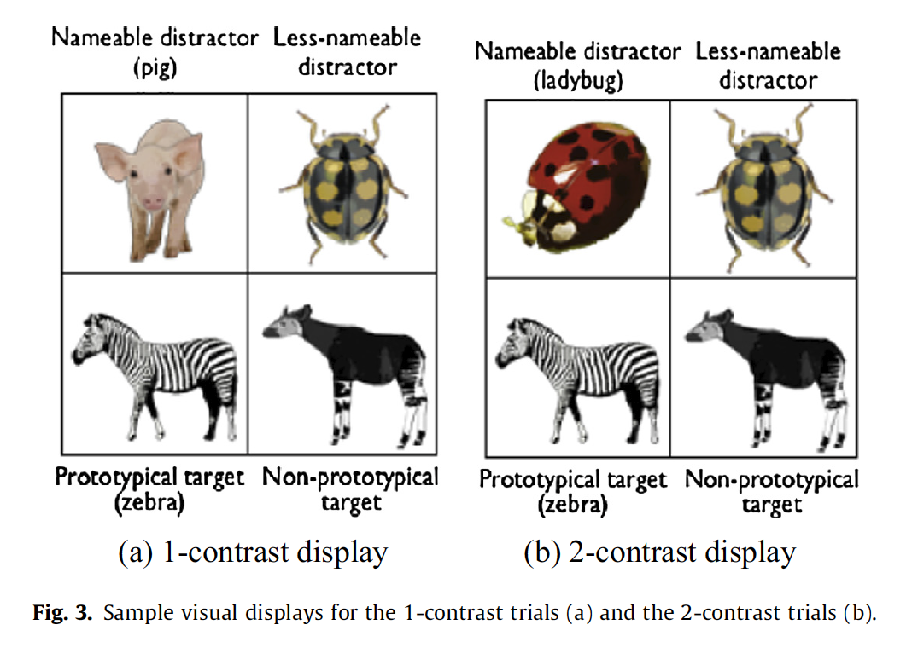

```{r, load_refs, include=FALSE, cache=FALSE}
library(RefManageR)
BibOptions(check.entries = FALSE,
           bib.style = "authoryear",
           cite.style = "alphabetic",
           style = "markdown",
           hyperlink = FALSE,
           dashed = FALSE)
citations <- ReadBib("./citations.bib", check = FALSE)
```

```{r echo=FALSE, out.width="50%"}
# this really isn't a necessary way of doing this but i committed
image1 <- 
image2 <- 
image3 <- knitr::include_graphics("images/model1.png")
image4 <- knitr::include_graphics("images/model2.png")
image5 <- 
image6 <- 
image7 <- 

```


# Introduction and background

- It's often assumed in psycholinguistics that pragmatic inference is slower and more resource intensive than other aspects of sentence processing. 
- BUT more recent studies suggest that listeners are actually able to use contextual information to form expectations which can facilitate pragmatic inference
--

- ### Sedivy et al (1999)
  - prenominal adj. facilitates reference resolution when a contrasting item is present 
- ### Watson et al (2008)
  - rapid online generation of pragmatic expectation based on visually represented contrasts for contrastive interpretation 

---
# Introduction and background 

## issues with these studies?

.pull-left[- relevant contrast was _explicitly_ mentioned prior in the discourse. 
   - difficult to generalize findings to cases hwere context contrast set is determined online (not based on previous explicit mention)
- solution?
  - visual word experiment using _it looks like an X_ construction
    - one using declarative prosodic contour (noun-focus)
    - one using contrastive L + H* on verb with rising L-H% boundary tone (Verb-focus prosody)
]

.pull-right[
`r image6`
]
    

---
# Introduction and background 
## questions addressed in this paper:

1. can listeners construct a contrast pair based on prosodic information? 
--
    - (YES)
--
2. is prosodic information integrated incrementally? 
--
    - (YES for the most part)
--
3. does the interpretation of LOOKS <sub>L+H*</sub> involve a contextually-supported inference
--
    - (YES) 


---

# (Quick) Mehods
  
## Stimuli

.pull-left[
- 16 imageable hi-frequency bi-syllabic nouns with initial frame
- native speaker recorded two tokens of each tiem with Noun-focus and Verb-focus prosody
- 44 filler items
  - the filler items (other than the "it looks like..") were unambiguous in order to show that the speaker is generally cooperative
- there were 60 4-pic displays w/16 critical and 44 filler
  - half the critical trials were 1-contrast 
  - half were 2-contrast
]

.pull-right[
`r image1`
`r image7`
]


---
# Predictions

## - if contrastive accent is interpreted incrementally....
  - in the 1-contrast display, there should be an increase in fixations to contrast set after LOOKS<sub>L+H*</sub> and earlier gaze shifts to the non-prototypical target 
  
## - if using a context-*independent* heuristic....
  - there shouldn't be an effect of dispaly type because the atypical prosodic contour should shift the gaze to the atypical representation (non-prototypical and less-nameable distractor) with same time-course regardless of if it's 1 or 2 contrast


---

# Results

## dependent measure

- three main measures: picture choice, proportion of fixations to alternatives within display, mouse-clicking RT

## method of analysis?

- Mutli-level generalized linear regression models

---
# Results
## Picture choice

- unambiguous filler trials: 96% accuracy 
- critical trials
  - noun-focus prosody: 65.5% of trials selected prototypical target picture 
  - verb-focus prosody: 25.5% of trials selected prototypical target picture
- no further analyses here
  
---

# Results
## Eye-movements
- proportion of fixations to prototypical vs. non-prototypical pictures in 1-contrast and 2-contrast displays 
- 1 contrast displays
  - verb-focus prosody elicited more fixations to the non-prototypical target prior to the onset of the last noun
- 2 contrast displays
  - fixations in non-prototypical targets in response to verb-focus prosody and prototypical targets in response to noun-focus prosody began to increase 200ms after noun-onset 
  
.pull-justify[`r image2`]

---
# Results
## Eye-movements
### Model 1

.pull-left[
  - DV: logit-transformed log-odds ratios of fixations to either *members of the target contrast (e.g., zebra & okapi) set vs. all pictures*
  - predictors: 
      - prosody condition (Noun-focus vs. Verb focus)
      - display type (1- vs. 2-contrast)
      - trial number
  - random effects structure:
          - random intercepts and slopes for prosody and display type by participants and prosody, display type, and trial number by items.
            - this accounts for possible variation in responses per participants and depending on prosody condition as well as items themselves. 
]
.pull-right[`r image3`
- note the main effect of prosody and interaction `prosody:display-type` are significant
]

---
# Results
## Eye-movements
### Model 1
- why this analysis?
    - to see if the contrastive accent on the verb triggered more fixations to contrast-set members (e.g., zebra vs. okapi) in 1-contrast trials which would indicate that prosodic contours are interpreted with respect to visually-represented contrasts
    - they used a Multi-level generalized linear regression because...
      - "multi-level": they wanted to account for grouping factors through the use of random slopes and intercepts
      - "generalized": the DV was the *proportion* of fixations to target contrast set vs. all pictures
            - this was transformed using the logit function

---
# Results 
## Eye-movements
### Model(s) 2 

.pull-left[
- DV: logit-transformed log-odds ratios of proportion fixations to either *non-prototypical targets vs. fixations to both target pictures*
    - predictors:
        - prosody condition (Noun-focus vs. Verb focus)
        - display type (1- vs. 2-contrast)
    - random effects structure:
          - random intercepts and slopes for prosody and display type by participants and prosody, display type, and trial number by items (same)
]

.pull-right[
`r image4`
- note that prosody condition is significant
- trial number & it's interactions not significant
  - although I don't see this in the model output above...?
]

---
# Results 
## Eye-movements
### Model(s) 2 

- subsequent models that analyzed the display types separately (whose output is not displayed in the paper) additionally showed...  
  - 1 contrast displays
      - when using Verb-focus prosody, there was a significant bias toward the non-prototypical target
          -  $\beta$ = .95, t = 3.07, p < 0.005
  - 2 contrast displays
      - prosody was not a significant predictor 
          - in other  words, participants weren't necessarily more likely to likely to look at the prototypical target. Instead, participants were just generally more likely to still look at the non-prototypical target.
  
---
# Results
## Eye-movements

.pull-left[
- so are people just using a hueristic or not?
- given that in  1-contrast trials, participants fixated the target contrast set  more than the less-nameable (still odd), it suggests that the interpertation was derived wrt contrast-set membership instead of just visual typicality. 
- you can't really draw any conclusions from the 2-contrast display other than the non-target prototypical having the highest proportion of looks (which is unexpected)
]

.pull-right[`r image5`]

---
# Results
## Mouse-click RT

- RTs were calculated by: time of picture selection - time utterance ended
- RTs were log-transformed
    - this is fairly standard from what I can tell in the literature
---
# Results
## Mouse-click RT

- analyzed using another linear model although the details here are left out. 
-  generally, effect of prosody on RT was dependent on whether the selected picture was prototypical or non-prototypical
    - $\beta$ = .509, t = 2.94, p < .005
--
- trials w/Noun-focus prosody
    - RTs were faster when the prototypical was selected vs. non-prototypical
        -  $\beta$ = .272, t = 3.20, p < .005
--
- trials w/Verb-focus prosody
    - RTs were slower for prototypical vs. non-prototypical targets
    - this is just a trend though and it didn't reach significance
        - $\beta$ = .201, t = 1.10, p > .10
    - RTs were slower overall for Verb-focus prosody
        - $\beta$ = .242, t = 2.09, p < .05
--
- overall, these data would have been consistent with delayed pragmatic inference unlike the eye-tracking data
    - hence, the "for the most part"

---
# Conclusions

- Overall, this study showed...

1. that listeners can construct a contrast pair based on prosodic information? 
2. prosodic information is integrated incrementally, but that there is an inconsitency between the eye-tracking data and the mouse-clicks. 
      - given the fact that this is an asymmetry that is seen in other parts of the literature, perhaps it's not entirely surprising. It could be prosodic information is processed in parallel to other segmental information, but that integration itself may be taking longer. 
          - e.g., discussion in Reinisch and Sjerps (2013), Cho et al (2007), Brown et al (2011)
3. it does look like the interpretation of LOOKS <sub>L+H*</sub> involves a contextually-supported inference since we didn't see the generalization of looks towards atypical images as predicted by the heuristic

---

# Appropriateness of Analysis
## GLMMs
- Using a GLMM is generally what is done in the field as far as I can tell, so this wasn't unusual in terms of choice of analysis
- However, it is the case that many of the analyses using a linear regression are moving towards Bayesian methods, but this paper was published in 2014 so it's not surprising that they use a frequentist model.
- using a logit-transformation for porportion of fixation is also not unusual
- altogether, I think that their analysis was both appropriate and their explanations and interpretations were accurate
- the next slide, however, will discuss more general comments regarding their analysis 

---

# Presentation of Results
## General comments
- They did a good job of displaying their results for the first two models for the  most part
    - although I would have liked to have actually seen more information about their random effects
    - I also noticed that in their second model the graph didn't actually display the trial number even though they reference it
        - I'm not sure if this is a mistake on their part or if I am interpreting it incorrectly
- Once again, they use a random effects structure but only briefly mention this in the description above the tables for their model.
    - They also only describe how they determined what random effects they used in a footnote that would be easily missed. 
    - additionally, there is no information at all about any other random effects (if any) that are used in the other models that aren't summarized in one of the two tables
-  Finally, there is also no mention of how the variables were coded at all and no access to data/analyses to check
    - although this usually the case
    

---
# What I liked/disliked

- I liked that the analyses were fairly straight to the point, but at the same time I didn't like that a lot of information was glossed over because of this. 
- I also would have liked a possible interpretation for the null finding for the 2-contrast trials
    - but since this is a brief article, it's not surprising that it is not discussed here
    
---
# Citations

```{r refs, echo=FALSE, results="asis"}

print(citations[key = "brown_expectations_2011"], 
  .opts = list(check.entries = FALSE, 
               style = "html", 
               bib.style = "authoryear"))
print(citations[key = "cho_prosodically_2007"], 
  .opts = list(check.entries = FALSE, 
               style = "html", 
               bib.style = "authoryear"))
print(citations[key = "kurumada_is_2014"], 
  .opts = list(check.entries = FALSE, 
               style = "html", 
               bib.style = "authoryear"))
print(citations[key = "reinisch_uptake_2013"], 
  .opts = list(check.entries = FALSE, 
               style = "html", 
               bib.style = "authoryear"))
```
