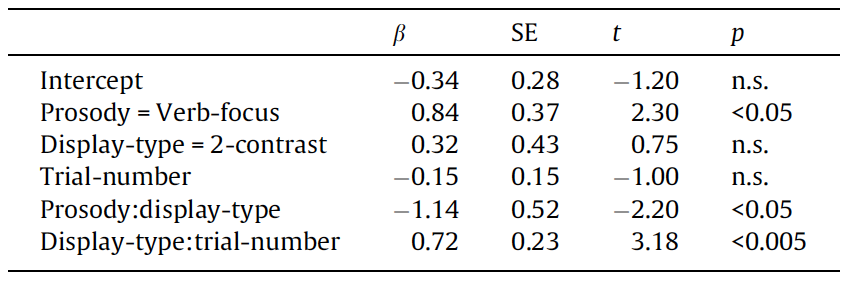
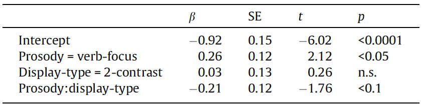

# Introduction and background

- It's often assumed in psycholinguistics that pragmatic inference is slower and more resource intensive than other aspects of sentence processing. 
- BUT more recent studies suggest that listeners are actually able to use contextual information to form expectations which can facilitate pragmatic inference
- ### Sedivy et al (1999)
  - prenominal adj. facilitates reference resolution when a contrasting item is present 
- ### Watson et al (2008)
  - rapid online generation of pragmatic expectation based on visually represented contrasts for contrastive interpretation 

---
# Introduction and background 

## issues with these studies?

- relevant contrast was _explicitly_ mentioned prior in the discourse. 
   - difficult to generalize findings to cases hwere context contrast set is determined online (not based on previous explicit mention)
- solution?
  - visual word experiment using _it looks like an X_ construction
    - one using declarative prosodic contour (noun-focus)
    - one using contrastive L + H* on verb with rising L-H% boundary tone (Verb-focus prosody)


---

# Introduction and background

## questions addressed in this paper:

1. can listeners construct a contrast pair based on prosodic information?
  
---

# Introduction and background

## questions addressed in this paper:

1. can listeners construct a contrast pair based on prosodic information? 
    - (YES)
2. is prosodic information integrated incrementally? 

---
# Introduction and background


## questions addressed in this paper:

1. can listeners construct a contrast pair based on prosodic information? 
    - (YES)
2. is prosodic information integrated incrementally? 
    - (YES for the most part)
3. does the interpretation of LOOKS <sub>L+H*</sub> involve a contextually-supported inference
  
---
# Introduction and background

## questions addressed in this paper:

1. can listeners construct a contrast pair based on prosodic information? 
    - (YES)
2. is prosodic information integrated incrementally? 
    - (YES for the most part)
3. does the interpretation of LOOKS <sub>L+H*</sub> involve a contextually-supported inference 
    - (YES) 


---

# (Quick) Mehods
  
## Stimuli

- 16 imageable hi-frequency bi-syllabic nouns with initial frame
- native speaker recorded two tokens of each tiem with Noun-focus and Verb-focus prosody
- 44 filler items
  - the filler items (other than the "it looks like..") were unambiguous in order to show that the speaker is generally cooperative
  
.pull-left[
- there were 60 4-pic displays w/16 critical and 44 filler
  - half the critical trials were 1-contrast 
  - half were 2-contrast
]
  
```{r echo=FALSE, out.width="50%"}
image1 <- knitr::include_graphics("images/stim.png")
```

.pull-right[
`r image1`
]


---
# Predictions

## - if contrastive accent is interpreted incrementally....
  - in the 1-contrast display, there should be an increase in fixations to contrast set after LOOKS<sub>L+H*</sub> and earlier gaze shifts to the non-prototypical target 
  
## - if using a context-*independent* heuristic....
  - there shouldn't be an effect of dispaly type because the atypical prosodic contour should shift the gaze to the atypical representation (non-prototypical and less-nameable distractor) with same time-course regardless of if it's 1 or 2 contrast


---

# Results

## dependent measure

- three main measures: picture choice, proportion of fixations to alternatives within display, mouse-clicking RT

## method of analysis?

- Mutli-level generalized linear regression models

---
# Results
## Picture choice

- unambiguous filler trials: 96% accuracy 
- critical trials
  - noun-focus prosody: 65.5% of trials selected prototypical target picture 
  - verb-focus prosody: 25.5% of trials selected prototypical target picture
  
---

# Results
## Eye-movements
- proportion of fixations to protypical vs. non-prototypical pictures in 1-contrast and 2-contrast displays 
- 1 contrast displays
  - verb-focus prosody elicited more fixations to the non-prototypical target prior to the onset of the last noun
- 2 contrast displays
  - fixations in non-prototypical targets in response to verb-focus prosody and prototypical targets in response to noun-focus prosody began to increase 200ms after noun-onset 
```{r echo=FALSE, out.width="40%"}
image2 <- knitr::include_graphics("images/eyemovres.png")
```
.pull-center[`r image2`]

---
# Results
## Eye-movements
### Model 1
```{r echo=FALSE, out.width="40%"}
image3 <- 
image4 <- 
```
.pull-left[
  - dv: logit-transformed log-odds ratios of fixations to either member of the target contrast (e.g., zebra & okapi) set vs. all pictures
  - predictors: 
      - prosody condition (Noun-focus vs. Verb focus)
      - display type (1- vs. 2-contrast)
      - trial number
]
.pull-right[`r image3`
- note the main effect of prosody and interaction `prosody:display-type` are significant
]

---
# Results
## Eye-movements
### Model 1
- why this analysis?
    - to see if the contrastive accent on the verb triggered more fixations to contrast-set members (e.g., zebra vs. okapi) in 1-contrast trials which would indicate that prosodic contours are interpreted with respect to visually-represented contrasts
    - they used a Multi-level generalized linear regression because...
      - multi-level: they wanted to account for grouping factors through the use of random slopes and intercepts
        - the full random effects structure used in their model was the following:
          - random intercepts and slopes for prosody and display type by participants and prosody, display type, and trial number by items.
            - this accounts for possible variation in responses per participants and depending on prosody condition as well as items themselves. 
      - generalized: the DV was categorical - fixations to target contrast set vs. all pictures
            - this was transformed using the logit function
        
---
# Results 
## Eye-movements
### Model 2 

.pull-left[
- dv: logit-transformed log-odds ratios of fixations to either non-prototypical targets vs. fixations to both target pictures
      - prosody condition (Noun-focus vs. Verb focus)
      - display type (1- vs. 2-contrast)
]

.pull-right[
`r image4`
]

---

# more stuff
